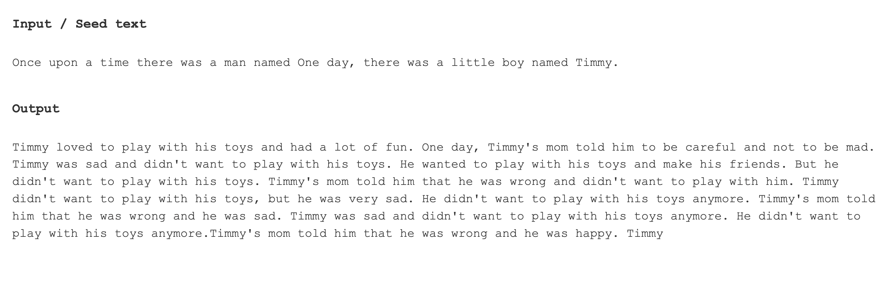
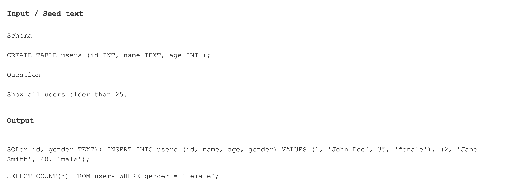

# English to SQL with a Small Language Model

I built a language model from scratch, trained it on SQL, and it still refused to listen to me 😁

This project documents an experiment in building a small language model that takes an English instruction and generates an SQL query — essentially a tiny, SQL-focused version of ChatGPT.

## Project overview

The MVP is intentionally small:

- Approximately 40M parameters for the SQL model
- Roughly 60M training tokens
- A Transformer implementation built from scratch
- Training and experimentation inspired by Andrej Karpathy's lectures

Before moving to SQL, I tested the Transformer on TinyStories using a model with approximately 17M parameters trained on around 18M tokens. The output was surprisingly decent for such a small and undertrained model.

### Stage 1: TinyStories

The first stage trained the model on TinyStories to validate the Transformer implementation and generation pipeline.



### Stage 2: SQL

The second stage trained a larger model on SQL-related data. The goal was to map an English request, together with a database schema, to the correct SQL query.

Example:

```text
English: Show all users older than 25.
SQL:     SELECT * FROM users WHERE age > 25;
```

I initially tried scraping SQL from GitHub, but GitHub provides the code rather than the English instruction describing the query. I eventually used a text-to-SQL dataset from Gretel on Hugging Face and combined it with additional SQL-related data.

The model learned SQL syntax — including `SELECT`, `WHERE`, `COUNT`, `CREATE TABLE`, dates, and conditions — but it did not reliably follow the requested instruction. Instead, it often invented patients, random dates, nested `COUNT` queries, and entirely new tables: SQL-flavoured gibberish.



## What went wrong?

The validation loss was extremely low, which showed that the model was learning patterns in the training data. However, the training setup did not teach it the exact relationship between database schemas, English questions, and their intended SQL outputs.

The next step is supervised fine-tuning (SFT), explicitly training the current model on schema, question, and correct SQL-output examples. Future work will explore the training setup, context length, dataset structure, and SFT in more detail.

> This README describes the project experience and results. AI assistance was used minimally for grammar corrections.
